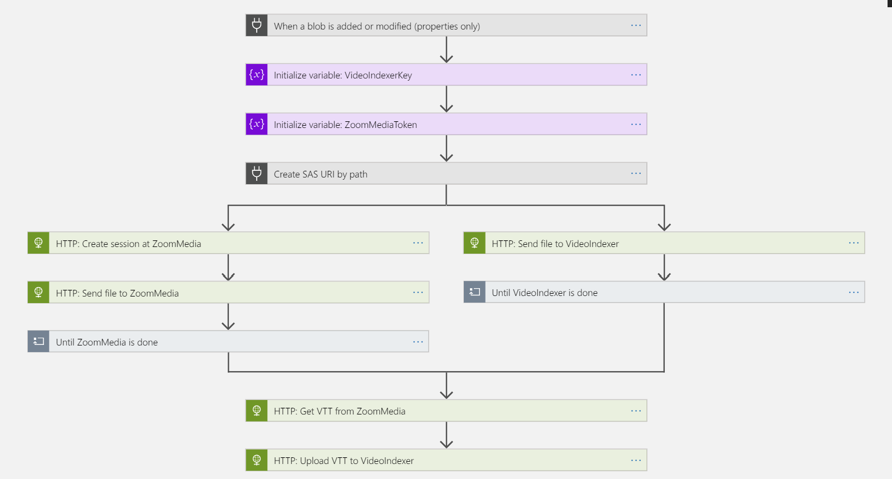

# Video Indexer + Zoom Media

## Introduction
The Microsoft [Video Indexer](https://www.videoindexer.ai/) service extracts valuable insights from videos, such as spoken words, faces, characters and emotions. The service supports many of the major world languages (but not every language, e.g. Dutch). But there are companies such as Zoom Media that offer a [speech-to-text](https://www.zoom-media.nl/en/speech-to-text/) service in other languages (e.g. Dutch). Below is a description of how you can use a transcription service provider (such as Zoom Media) in conjunction with Microsoft Video Indexer.

The PowerShell script included in this repo will deploy a set of Azure resources that integrate the Microsoft Video Indexer service with Zoom Media's speech-to-text service. This script can be easily updated to work with other transcription service providers to cover a broader range of languages.

## Deployment
`.\deploy.ps1 -videoindexerkey xxxxxxxxxxxxxxxxxxxxxxxxxxxxxxxx -zoommediatoken yyyyyyyyyyyyyyyyyyyyyyyyyyyyyyyyyyyyyyyyyy`

Note: The two parameters _videoindexerkey_ and _zoommediatoken_ are required.

The following resources are deployed:
* Resource Group
* Storage Account
* API Connection
* Logic App

## Solution flow
1. A file is dropped into Blob Storage ("uploads" container by default)
2. Logic App watches for new blobs being added
3. Logic App sends the file to Video Indexer and Zoom Media
4. Zoom Media generates a VVT file based on the Dutch language
5. Logic Apps passes the resulting VTT  back into Video Indexer

## How to get the Video Indexer key
The Video Indexer service does not require signup; one can simply sign in using existing credentials. Once signed in navigate to the [API Reference](https://videobreakdown.portal.azure-api.net/). Sign in here and register for the API on the [Products](https://videobreakdown.portal.azure-api.net/products) page. Once this is done, the [Profile](https://videobreakdown.portal.azure-api.net/developer) page will show the primary and secondary key.

## How to get the Zoom Media token

The Zoom Media service does require signup; please contact <info@zoommedia.nl>.

Once signed up, a token can be generated on the Settings page

## Additional notes
* Currently the Logic App supports Dutch but this can be changed in the app itself. The steps _HTTP: Create session at ZoomMedia_ and _HTTP: Update VTT at VideoIndexer_ contain language strings that can be changed.

* Note that the file will be indexed _twice_ by VideoIndexer: Once during the initial upload, and once when the VTT is updated in the end. Please wait for the Logic App to completely finish before expecting the video Transcript to be correct in the Video Indexer UI.

## Logic app flow

## Advanced template
As HTTP calls in Logic Apps time out after 2 minutes, any upload that takes longer will time out the basic logic app. The advanced template takes care of that by making use of callbacks for both the VideoIndexer upload as well as the ZoomMedia upload. 

This advanced template will generate 3 separate Logic Apps, each taking care of one upload. The VideoIndexer and Logic Apps keys are present in each of these. 