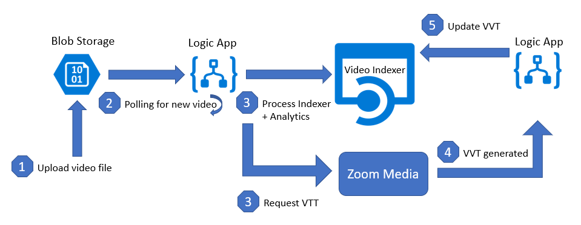
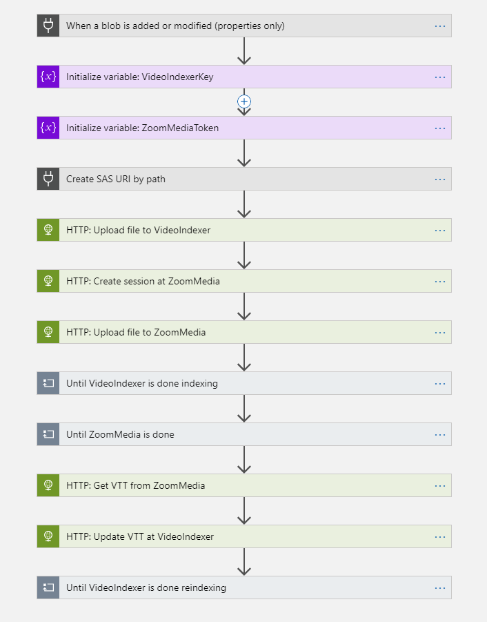

# Video Indexer + Zoom Media

## Introduction
The Microsoft [Video Indexer](https://www.videoindexer.ai/) service extracts valuable insights from videos, such as spoken words, faces, characters and emotions. The service supports many of the major world languages but unfortunately does not support Dutch. Our partner Zoom Media offers a [speech-to-text](https://www.zoom-media.nl/en/speech-to-text/) service that does support Dutch. 

This PowerShell script will deploy a set of Azure resources that integrate the Microsoft Video Indexer service with Zoom Media's speech-to-text service.

## Deployment
`.\deploy.ps1 -videoindexerkey xxxxxxxxxxxxxxxxxxxxxxxxxxxxxxxx -zoommediatoken yyyyyyyyyyyyyyyyyyyyyyyyyyyyyyyyyyyyyyyyyy`

Note: The two parameters _videoindexerkey_ and _zoommediatoken_ are required.

The following resources are deployed:
* Resource Group
* Storage Account
* API Connection
* Logic App

## Solution flow
1. A file is dropped into Blob Storage and
2. picked up by the Logic App that
3. sends the file to Video Indexer for analytics and after that
4. sends the file to Zoom Media for speech-to-text.
5. Finally the resulting VTT is passed back into Video Indexer.

## How to get the Video Indexer key
The Video Indexer service does not require signup; one can simply sign in using existing credentials. Once signed in navigate to the [API Reference](https://videobreakdown.portal.azure-api.net/). Sign in here and register for the API on the [Products](https://videobreakdown.portal.azure-api.net/products) page. Once this is done, the [Profile](https://videobreakdown.portal.azure-api.net/developer) page will show the primary and secondary key.

## How to get the Zoom Media token

The Zoom Media service does require signup; please contact <info@zoommedia.nl>.

Once signed up, a token can be generated on the Settings page

## Additional notes
* Currently the Logic App supports Dutch but this can be changed in the app itself. The steps _HTTP: Create session at ZoomMedia_ and _HTTP: Update VTT at VideoIndexer_ contain language strings that can be changed.

* Note that the file will be indexed _twice_ by VideoIndexer: Once during the initial upload, and once when the VTT is updated in the end. Please wait for the Logic App to completely finish before expecting the video Transcript to be correct in the Video Indexer UI.

## Logic app flow

